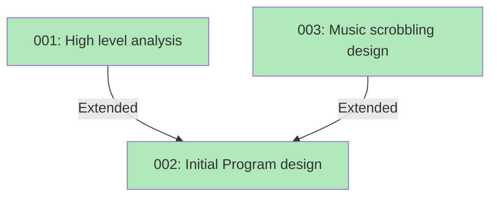

[ADR](https://lyz-code.github.io/blue-book/adr/) are short text documents that
captures an important architectural decision made along with its context and
consequences.

```mermaid
graph TD
    001[001: High level analysis]
    002[002: Initial Program design]
    003[003: Music scrobbling design]

    001 -- Extended --> 002
    003 -- Extended --> 002

    click 001 "https://lyz-code.github.io/pyscrobbler/adr/001-high_level_problem_analysis" _blank
    click 002 "https://lyz-code.github.io/pyscrobbler/adr/002-initial_plugin_design" _blank
    click 003 "https://lyz-code.github.io/pyscrobbler/adr/003-music_scrobbling_design.md" _blank

    001:::accepted
    002:::accepted
    003:::accepted

    classDef draft fill:#CDBFEA;
    classDef proposed fill:#B1CCE8;
    classDef accepted fill:#B1E8BA;
    classDef rejected fill:#E8B1B1;
    classDef deprecated fill:#E8B1B1;
    classDef superseeded fill:#E8E5B1;
```
